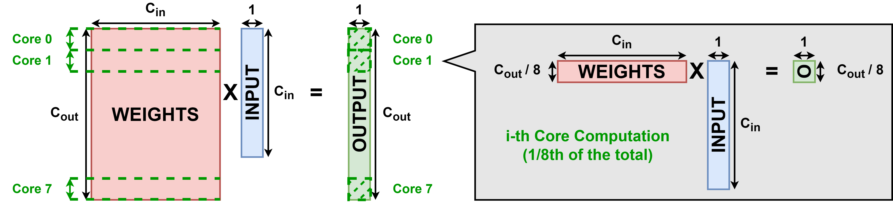

# TrainLib Deployer: code generation for you On-Device Learning project

This first exercise aims at showing you how you can generate and edit the code for On-Device Learning (ODL) on Convolutional Neural Networks with PULP-TrainLib.

At the end of this tutorial you will learn how to:
- generate ODL code with TrainLib_Deployer
- compile a project containing PULP-TrainLib
- interpret performance metrics
- understand and edit ODL code on MCUs
- parallelize you core on the PULP Cluster

First, we will modify the `USER SECTION` of [TrainLib_Deployer](../pulp-trainlib/tools/TrainLib_Deployer/TrainLib_Deployer.py) to generate the code for a CNN, deployed with FP32 computations.

## Defining or importing your CNN

NOTE: THE WAY TO GENERATE THE NETWORK SHOULD BE CHANGED (CRISTI + ME)

To generate this example, first overwrite the corresponding lines of [TrainLib_Deployer](../pulp-trainlib/tools/TrainLib_Deployer/TrainLib_Deployer.py) with the content of [CNN_FP32.txt](CNN_FP32.txt).

In this tutorial, we will generate and validate a simple three-layer DNN, composed as follows:


## Generate a FP32 CNN

With a terminal open in this repository root folder (PULP-TrainLib-Tutorial/) run the TrainLib_Deployer to generate the sample ODL code in a specified folder:

```
conda activate trainlib-tutorial
cd ../pulp-trainlib/tools/TrainLib_Deployer
python TrainLib_Deployer.py
```

This will generate the code in `Ex01-TrainLib_Deployer/CNN_FP32/`, as specified in the options. Then, setup the environment with:

```
cd ../../..
source setup.sh
```
Now, the terminal is ready to compile the generated code. Let's:

```
cd Ex01-TrainLib_Deployer/CNN_FP32/
make clean get_golden all run
```

Executing the last command will generate the golden model from PyTorch (`make get_golden`) and compile the code for the execution on the PULP simulator (`make clean all run`). On the terminal, you will find both the functional and profiling information.

```
make clean         : deletes executable
make get_golden    : generates the Golden Model's reference files
make all           : compiles the C code application
make run           : executes the code on the PULP GVSoC simulator
```

The typical output of the generated example will be like: 

```
Hello sir.
Configuring cluster..

Launching training procedure...
Initializing network..
Testing DNN initialization forward..
Layer 2 output:        _
-0.000023               |
0.000048                |
-0.000030               |
0.000024                \
....                     \  DNN Output before ODL
0.000009                 /  
0.000061                /
-0.000025               |
-0.000021               |
-0.000006              _|

                                --- STATISTICS FROM CLUSTER CORE 0  ---
[0] cycles = 750474             <= Cycles to execute the program (LATENCY)
[0] instr = 579014              <= Number of instructions
[0] active cycles = 750506      <= Number of active cycles
[0] ext load = 13               <= Direct loads from L2
[0] TCDM cont = 0               <= Memory contentions in L1
[0] ld stall = 164539           <= Stalls while loading data
[0] imiss = 1793                <= Instruction cache misses
Checking updated output..

Layer 2 output:        _
-0.000023               |
0.000048                |
-0.000030               |
0.000024                \
...                      \  DNN Output AFTER ODL
0.000009                 / 
0.000061                /
-0.000025               |
-0.000021               |
-0.000006              _|
Exiting DNN Training.
```

## On-Device Learning Code: net.c

TrainLib_Deployer generates the On-Device Learning code in form of a set of functions and data definitions included into [net.c](CNN_FP32/net.c). Configuration options are included in the [Makefile](CNN_FP32/Makefile). This code is intended to work as a starting point for your application.

The reference and initialization data populating the weight and activation tensors is generated by PyTorch-written [GM.py](CNN_FP32/utils/GM.py) - the Golden Model or reference - into several files ([io-data.h](CNN_FP32/io_data.h), [init-defines.h](CNN_FP32/init-defines.h)), which are included by [net.c](CNN_FP32/net.c).

The structure of a training flow is managed by the following functions:

```C
void forward() {
    // First layer's primitive
    pulp_conv2d_fp32_fw_cl(&l0_args);
    // Second layer's primitive
    pulp_relu_fp32_fw_cl(&l1_args);
    // Last layer's primitive
    pulp_linear_fp32_fw_cl(&l2_args);
}

void backward() {
    // Last layer's primitive
    pulp_linear_fp32_bw_cl(&l2_args);
    // Second layer's primitive
    pulp_relu_fp32_bw_cl(&l1_args);
    // First layer's primitive
    pulp_conv2d_fp32_bw_cl(&l0_args);
}
```

The loss function is managed by the `void compute_loss()` function, while the `void update_weights()` method takes care of updating the weights after each training iteration. 

Note that each backward primitive internally executes both the input gradient and the weight gradient primitives. E.g., for a Fully-Connected layer: 

```C
void pulp_linear_fp32_bw_cl( void * Linear_args )
{
  struct Linear_args * FC_args = (struct Linear_args *) Linear_args;
  int skip_in_grad = FC_args->skip_in_grad;

  pulp_linear_fp32_bw_param_grads_cl(Linear_args);
  if (skip_in_grad == 0) 
  {
    pulp_linear_fp32_bw_input_grads_cl(Linear_args); 
  }
}
```

The `skip_in_grad` parameter can be set to 1 to avoid the computation of the input gradient in case the layer is the first of a DNN.

Each layer is connected to the static arrays through the `blob` structure, which represents a tensor. For example, in case of a Fully-Connected Layer (as Layer 2):

```C
// Statically define data (C arrays)
PI_L1 float l2_in[Tin_C_l2 * Tin_H_l2 * Tin_W_l2];
PI_L1 float l2_in_diff[Tin_C_l2 * Tin_H_l2 * Tin_W_l2];
PI_L1 float l2_ker[Tin_C_l2 * Tout_C_l2 * Tker_H_l2 * Tker_W_l2];
PI_L1 float l2_ker_diff[Tin_C_l2 * Tout_C_l2 * Tker_H_l2 * Tker_W_l2];
PI_L1 float l2_out[Tout_C_l2 * Tout_H_l2 * Tout_W_l2];
PI_L1 float l2_out_diff[Tout_C_l2 * Tout_H_l2 * Tout_W_l2];

// Define the tensors as "blobs"
PI_L1 struct blob layer2_in, layer2_wgt, layer2_out;

// Define the arguments for the Fully-Connected
PI_L1 struct Linear_args l2_args;
```

Then, the static arrays are linked to the `blob` and the `arguments` at runtime, during the initialization:

```C
void DNN_init() {
    // ...

    // Example of one tensor definition for Layer 2
    layer0_wgt.data = l0_ker;
    layer0_wgt.diff = l0_ker_diff;
    layer0_wgt.dim = Tin_C_l0*Tout_C_l0*Tker_H_l0*Tker_W_l0;
    layer0_wgt.C = Tin_C_l0;
    layer0_wgt.H = Tker_H_l0;
    layer0_wgt.W = Tker_W_l0;    

    // ...

    // Configuration structure for Layer 2
    l2_args.input = &layer2_in;
    l2_args.coeff = &layer2_wgt;
    l2_args.output = &layer2_out;
    l2_args.skip_in_grad = 0;
    l2_args.opt_matmul_type_fw = MATMUL_TYPE_FW_L2;
    l2_args.opt_matmul_type_wg = MATMUL_TYPE_WG_L2;
    l2_args.opt_matmul_type_ig = MATMUL_TYPE_IG_L2;
}
```

Now, the layer is ready to perform both forward and backward steps.

The training routine is triggered by the void `net_step()` function, which essentially performs the following routine:

```C
void net_step()
{
  DNN_init();
  forward();

  for (int epoch=0; epoch<EPOCHS; epoch++)
  {
    forward();
    compute_loss();
    backward();
    update_weights();
  }
}
```

## Latency of the ODL operations

In the previous section, we noticed a latency of `[0] cycles = 750474` while executing a single forward-loss-backward-update steps on a single RISC-V core on the PULP Cluster.

The latency of a single online learning step can be broken down into the single components by profiling the single components with PULP's performance counters. To profile the execution of a piece of code on PULP, we can use the functions defined in [stats.h](CNN_FP32/stats.h). For example, if we want to profile the backward:

```C
void net_step()
{
  // Initialize the performance counters
  INIT_STATS();
  PRE_START_STATS();

  DNN_init();
  forward();

  for (int epoch=0; epoch<EPOCHS; epoch++)
  {
    forward();
    compute_loss();

    // Start profiling
    START_STATS();
    backward();
    // Stop profiling
    STOP_STATS();

    update_weights();
  }
}
```

Back to the previous example, the latency can be broken down as:

```
Forward Step:   273443 
    Conv2D:     192654 
    ReLU:       5489 
    Linear:     74873 

Loss:           582 

Backward Step:  379667 
    Linear:     174313 
    ReLU:       6412
    Conv2D:     198747 

Weight Update:  98227
```

Note that the latency of the Linear's backward step takes 2.5 times to execute with respect to the forward: this is due to the computation of both `pulp_linear_fp32_bw_param_grads_cl()`, computing the weight gradient, and `pulp_linear_fp32_bw_input_grads_cl()`, computing the input gradient, which are executed in sequence by `pulp_linear_fp32_bw_cl()`. Otherwise, being the first layer, the Conv2D layer feaures similar latency (`pulp_conv2d_fp32_bw_cl()` skips `pulp_conv2d_fp32_bw_input_grads_cl()`).

Also note that using the performance counters introduces tenth of cycles of latency to read from them. Therefore, the sum of the components of each step (e.g., the sum of the latencies of the forward pass) will result a bit higher than the profiling of the step itself. For example, summing the contributions of Conv2D, ReLU and Linear in the forward step results in 57684 clock cycles, indicating 226 cycles were spent to read the statistics of the single components.


## Parallelizing over 8 Cores

The code that was previously generated runs on a single core (`NUM_CORES=1`). We can exploit the available Cluster cores (8 in this case) by modifying the parameter `NUM_CORES=8` into the [Makefile](CNN_FP32/Makefile) accordingly.

Then, the code can be recompiled with:

```
rm -rf BUILD/; make clean all run
``` 

As 8 Cores can be used for the computation, a maximum speedup of 8x can be expected. For this particular DNN, parallelization is not ideal, due to the small sizes of each layers' tensors. Indeed, the total cycles can be reduced by 6.97 times:

```
[0] cycles = 750474     <= Cycles with 1 Core
[0] cycles = 107639     <= Cycles with 8 Cores
PARALLEL SPEEDUP: 750474 / 107639 = 6.97 x
```

Looking at the single components and indicating on the left the cycles on 1 core, and on the right the ones on 8 cores, we find that:

```
Forward Step:   273443 / 39618    = 6.90 x
    Conv2D:     192654 / 28157    = 6.84 x
    ReLU:       5489 / 929        = 5.91 x
    Linear:     74873 / 11882     = 6.30 x

Loss:           582 / 593         = 0.98 x  (not parallel)

Backward Step:  379667 / 53830    = 7.05 x
    Linear:     174313 / 23861    = 7.31 x
    ReLU:       6412 / 1008       = 6.36 x
    Conv2D:     198747 / 29131    = 6.82 x 

Weight Update:  98227 / 12568     = 7.81 x
```

The overall effect on the parallelization depends on the single components of each step, according to the Ahmdal's Law.


```
EXPLAIN THE WHY OF BLAS OPERATORS
```


To understand how PULP-TrainLib implements parallelism, let's consider the case of a Fully-Connected Layer, whose, e.g., Forward Step can be expressed as Matrix Multiplication:



One way to exploit parallelism is to distribute the computation of only 1/Nth of the rows the first matrix - i.e., the weights - to each core. The output matrix - the layer's output - is computed as different chunks, distributed over the available cores, which share the second operand. All the chunks are computed at the same time, leading to a teoretical speedup equal to the number of available cores (8 in this case).

In PULP architectures, parallelization is managed by the function `pi_cl_team_fork(NUM_CORES, parallel_function, &args)`, which forks the computation of a `parallel_function` over the available cores. In the considered case (see [pulp_linear_fp32.c](../pulp-trainlib/lib/sources/pulp_linear_fp32.c), `pulp_linear_fp32_fw_cl()`), parallelization is cast as:

```C
// Define stucture to wrap Matrix Multiplication (MM)
struct matMul_args matMul_args;
// Fill fields with operands
matMul_args.A = coeffData;              // First matrix
matMul_args.B = inputData;              // Second matrix
matMul_args.C = outData;                // Output matrix
matMul_args.N = FC_args->output->dim;   // Rows of the first matrix
matMul_args.K = FC_args->input->dim;    // Columns of the first / rows of the second
matMul_args.M = 1;                      // Rows of the second matrix

// Parallelize the MM over NUM_CORES (defined in Makefile as 8)
pi_cl_team_fork(NUM_CORES, mm, &matMul_args);
```

Internally, the Matrix Multiplication kernel (see [pulp_matmul_fp32.c](../pulp-trainlib/lib/sources/pulp_matmul_fp32.c), `mm()`) is set to automatically recognize and compute its own chunk as soon as the funtion is executed by a Core:

```C
void mm(void * matMul_args) 
{
  // Set up the argsuments
  struct matMul_args* args = (struct matMul_args *)matMul_args;
  float * __restrict__ A = args->A;
  float * __restrict__ B = args->B;
  float * __restrict__ C = args->C;
  const uint32_t N = args->N;
  const uint32_t M = args->M;
  const uint32_t K = args->K;

  // Detect the chunk depending on the Core that executes
  const uint32_t blockSize = (N+NUM_CORES-1) / NUM_CORES;
  const uint32_t start = pi_core_id()*blockSize;
  const uint32_t stop = start+blockSize > N ? N : start+blockSize;

  // Perform partial Matrix Multiplication
  for (uint32_t i=start; i < stop; i++) 
  {
    for (uint32_t j = 0; j < M; j++) 
    {
      float temp = 0;
      for (uint32_t k = 0; k < K; k++) 
      {
        temp += A[i*K+k] * B[j+k*M];
      } 
      C[i*M+j] = temp;
    } 
  }   
}
```


## References

> D. Nadalini, M. Rusci, G. Tagliavini, L. Ravaglia, L. Benini, and F. Conti, "PULP-TrainLib: Enabling On-Device Training for RISC-V Multi-Core MCUs through Performance-Driven Autotuning" [SAMOS Pre-Print Version](https://www.samos-conference.com/Resources_Samos_Websites/Proceedings_Repository_SAMOS/2022/Papers/Paper_14.pdf), [Springer Published Version](https://link.springer.com/chapter/10.1007/978-3-031-15074-6_13)
