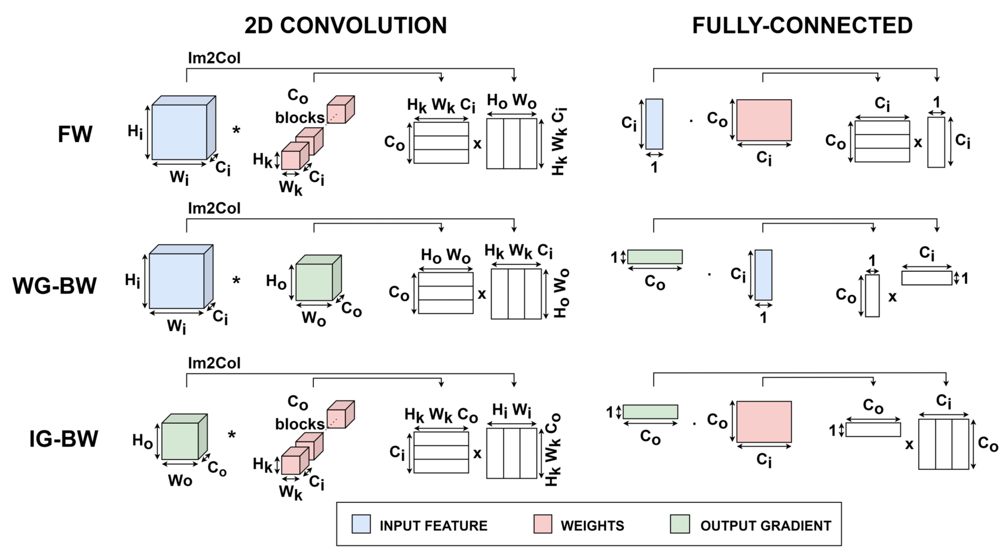

# Optimizing On-Device Learning primitives

In this second tutorial, we dig down into the primitives of PULP-TrainLib, to see how to optimize the inner kernels.

`Single core optimizations on a fully-connected layer: see that with a different MatMul you can optimize more.`

## "Everything as a Matrix Multiplication"

Almost every computational layer of CNNs can be visualized and computed as a matrix multiplication of suitably reshaped tensors. In case of a Fully-Connected Layer, each training step can be represented as follows:

## Hands on: optimizing the MatMul

`USE test_linear/ TO VERIFY THE LATENCY IMPROVEMENT & TALK ABOUT THE LIMITATIONS IN CASE OF NON-BATCHED FULLY-CONNECTED LAYERS.`

## References

> D. Nadalini, M. Rusci, G. Tagliavini, L. Ravaglia, L. Benini, and F. Conti, "PULP-TrainLib: Enabling On-Device Training for RISC-V Multi-Core MCUs through Performance-Driven Autotuning" [SAMOS Pre-Print Version](https://www.samos-conference.com/Resources_Samos_Websites/Proceedings_Repository_SAMOS/2022/Papers/Paper_14.pdf), [Springer Published Version](https://link.springer.com/chapter/10.1007/978-3-031-15074-6_13)

> D. Nadalini, M. Rusci, L. Benini, and F. Conti, "Reduced Precision Floating-Point Optimization for Deep Neural Network On-Device Learning on MicroControllers" [ArXiv Pre-Print](https://arxiv.org/abs/2305.19167)

