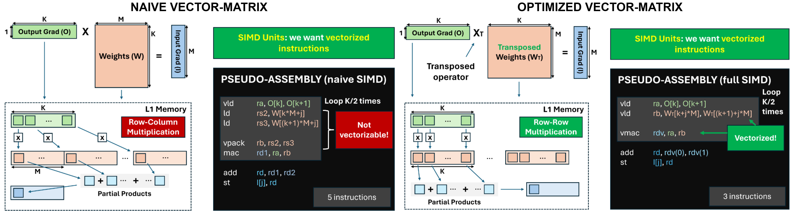

# Accelerating FP16 Training Primitives

This example shows the code optimizations to speed-up the computation of the training primitives when we use a half-precision floating-point datatype, also denoted as FP16. 

Learning Objectives:
- linear algebra kernels of the training primitives (mat mul or mat-vect mul)
- how to optimize a linear algebra operator with FP16 Single-Instruction-Multiple-Data (SIMD) Instructions

To understand these concepts, this example considers a Fully-Connected layer.

## Matrix Representation of ODL Layers

The CNN layer operations can be typically reshaped as Matrix Multiplications (MMs). 
In the case of a Fully-Connected Layer, the training steps can be represented as follows:


In this representation, the weight tensor, the input data, and the output gradient are used to compute the output, the weight gradient and the input gradient of the Fully-Connected layer. 
In particular, the weights of the Fully-Connected layer can be stored as a matrix of size `Cout x Cin`, while the input and output activations are of size `1 x Cin` and `1 x Cout`, respectively. 

## Optimizing a Vector-Matrix Multiplication with FP16 SIMD 

In the case the MCU is equipped with SIMD units with Reduced Precision (e.g., vectorized FP16), the data layout can be exploited to speed up the computation. 
In particular, both `load` and `multiply-and-accumulate (mac)` instructions can be used in their vectorized form to reduce the total number of instructions to compute a linear algebra operator, e.g., a Matrix Multiplication. 
Intuitively, this can be performed by `loading two adjacent elements from a single tensor` and by `multiplying couples of elements with a single instruction`.

As a starting point, let's consider the Input Gradient step of a Fully-Connected Layer. 
This step is implemented as the `vector-matrix` multiplication of the `Output Gradient (O)` and the `Weights (W)`, to compute the `Input Gradient (I)`. 
A naive implementation is shown on the left side of the figure below. 
2D tensors are stored in memory  as 1-D arrays, where adjacent elements belong to the same matrix row. 

When performing a vector-matrix multiplication, the naive version of the operator, using SIMD, should:
- load 2 adjacent elements of `O` as a vector (1 load instruction);
- load 2 elements of `W` in the same column (2 load instructions);
- pack the elements of `W` in a vector of 2 elements;
- multiply the vectorized `O` and `W`;
- accumulate the results. 

The extra load and the pack instructions represent an overhead. 



The previous operation can be optimized by introducing two simple changes:
- transpose the `W` matrix;
- the vector-matrix multiplication operates `row-by-row` instead of `row-by-column`.

The resulting operation is depicted on the right of the figure.
In this case, both the elements of `O` and the inputs from `W` are loaded as vectors and only a single SIMD MAC instruction is used (no pack). 
As a result, the inner loop of the linear algebra kernels features a reduced number of instructions, reducing the total latency by up to 40%.


## Example: optimizing a Matvec kernel

The previously introduced concept can be implemented as a linear algebra operator in C code, starting from the naive expression of the `vector-matrix` multiplication:

```C
void vm_naive (void * void_args) 
{
    struct matMul_args_fp16 * args = (struct matMul_args_fp16 *) void_args;
    fp16 * A = args->A;     // In this example, the Output Gradient
    fp16 * B = args->B;     // In this example, the Weight matrix
    fp16 * C = args->C;     // In this example, the Input Gradient
    uint32_t M = args->M; 
    uint32_t K = args->K;  

    for (int j = 0; j < M; j++) 
    {
        fp16 temp = 0;
        for (int k = 0; k < K; k++) 
        {
            temp += A[k] * B[k*M + j];
        }
        C[j] = temp;
    }
}
```

`Total estimated instructions: K*M*(2 ld + 1 mac) + M*(1 st) ~= 3*M*K + M`

The naive vectorized implementation casts the A operand as an FP16 vector `v2f16`, while the elements of B are loaded as in the previous case. 

```C
void vm_SIMD_naive (void * void_args) 
{
    struct matMul_args_fp16 * args = (struct matMul_args_fp16 *) void_args;
    fp16 * A = args->A;     // In this example, the Output Gradient
    fp16 * B = args->B;     // In this example, the Weight matrix
    fp16 * C = args->C;     // In this example, the Input Gradient
    uint32_t M = args->M; 
    uint32_t K = args->K;  


    for (int j = 0; j < M; j++) 
    {
        v2f16 temp = (v2f16) {0, 0};
        for (int k = 0; k < K; k+=2) 
        {
            // Load vectorized A (2 adjacent elements)
            v2f16 Av = *((v2f16*) &A[k]);
            // Load non-adjacent B elements and pack them
            fp16 B0 = B[k*M + j];
            fp16 B1 = B[(k+1)*M + j];
            v2f16 Bv = (v2f16) {B0, B1};
            // Multiply elementwise
            temp += Av * Bv;
        }
        C[j] = temp[0] + temp[1];
    }
}
```

In this case, to use the vectorial MAC unit, the elements of B need to be loaded and packed in the inner loop.

`Total estimated instructions: (K/2)*M*(3 ld + 1 pack + 1 mac) + M*(1 sum + 1 st) ~= (5/2)*K*M + 2*M`

The most optimized code is obtained by transposing offline the B matrix (the Weight Matrix) and:

```C
void vm_T_SIMD (void * void_args) 
{
    struct matMul_args_fp16 * args = (struct matMul_args_fp16 *) void_args;
    fp16 * A = args->A;     // In this example, the Output Gradient
    fp16 * B = args->B;     // In this example, the Weight matrix
    fp16 * C = args->C;     // In this example, the Input Gradient
    uint32_t M = args->M; 
    uint32_t K = args->K;  

    for (int j = 0; j < M; j++) 
    {
        v2f16 temp = (v2f16) {0, 0};
        for (int k = 0; k < K; k+=2) 
        {
            // Load both adjacent elements for A and B
            v2f16 Av = *((v2f16*) &A[k]);
            v2f16 Bv = *((v2f16*) &B[j*K + k]);
            temp += Av * Bv;
        }
        C[j] = temp[0] + temp[1];
    }
}
```
`Total estimated instructions: (K/2)*M*(2 ld + 1 mac) + M*(1 sum + 1 st) ~= (3/2)*M*K + 2*M`

## Optimizing a Fully-Connected Layer: Input Gradient Step

Using the previous tricks, the Input Gradient Step described above can be optimized by reducing by up to 40% the clock cycles to execute. 
The implemented functions can be found in [pulp_vector_matrix_fp16.h](./test_linear_fp16/lib/include/pulp_vector_matrix_fp16.h) and [pulp_vector_matrix_fp16.c](./test_linear_fp16/lib/sources/pulp_vector_matrix_fp16.c). 

In the following example, we consider a Fully-Connected Layer with input feature size of 128, output feature size of 128 and a weight matrix of size 128x128. 
After  `source ../setup.sh`, you can run:

```
cd test_linear_fp16/
make clean get_golden all run MATMUL_TYPE=0 TRANSPOSE_WEIGHTS=0
```

This first command launches the Input Gradient Step of the Fully-Connected with the naive Matrix Multiplication algorithm (like `vm_naive`). 
Therefore, no vectorization is introduced. 
In this case, we obtain:

```
--- vm_naive ---
Estimated Cycles:   3*M*K + M = 49280
Measured Cycles:                67386 
```

This second command launches the Input Gradient Step of the Fully-Connected with the naive SIMD Matrix Multiplication algorithm (like `mm_SIMD_naive`). 
```
make clean get_golden all run MATMUL_TYPE=1 TRANSPOSE_WEIGHTS=0
```

In this case, we obtain:

```
--- vm_SIMD_naive ---
Estimated Cycles:   (5/2)*K*M + 2*M = 41216
Measured Cycles:                      43611
```

The third command launches the Input Gradient Step of the Fully-Connected with the optimized SIMD Matrix Multiplication algorithm (like `mm_T_SIMD`). 

```
make clean get_golden all run MATMUL_TYPE=2 TRANSPOSE_WEIGHTS=1
```

In this case, we obtain:

```
--- vm_T_SIMD ---
Estimated Cycles:   (3/2)*M*K + 2*M = 24832
Measured Cycles:                      35268
```

## Parallelization + FP16 SIMD

On top of the previous optimization, the vector-matrix kernel can be further accelerated using parallelization. 
```
make clean get_golden all run MATMUL_TYPE=2 TRANSPOSE_WEIGHTS=1 NUM_CORES=8
```
The resulting performances are the following:
```
Cycles with 1 core:   35268
Cycles with 8 cores:  4620
Speedup:              7.63x
```
The speed up is obtained done by modifying the outer loop of the `vm_T_SIMD` function:

```C
void vm_T_SIMD_parallel (void * void_args) 
{
    struct matMul_args_fp16 * args = (struct matMul_args_fp16 *) void_args;
    fp16 * A = args->A;     // In this example, the Output Gradient
    fp16 * B = args->B;     // In this example, the Weight matrix
    fp16 * C = args->C;     // In this example, the Input Gradient
    uint32_t M = args->M; 
    uint32_t K = args->K;  

    // Add parallelization
    const uint32_t blockSize = (M+NUM_CORES-1) / NUM_CORES;
    const uint32_t start = pi_core_id()*blockSize;
    const uint32_t stop = start+blockSize > M ? M : start+blockSize;

    // For each parallel core, execute the reserved section only
    for (int j = start; j < stop; j++) 
    {
        v2f16 temp = (v2f16) {0, 0};
        for (int k = 0; k < K; k+=2) 
        {
            // Load both adjacent elements for A and B
            v2f16 Av = *((v2f16*) &A[k]);
            v2f16 Bv = *((v2f16*) &B[j*K + k]);
            temp += Av * Bv;
        }
        C[j] = temp[0] + temp[1];
    }
}
```

## Set FP16 Optimization in the TrainLib Deployer

To enable FP16 optimizations, layers need to be generated in FP16. This can be set, in TrainLib_Deployer, by properly setting to this format the desired layers (e.g., the DNN of [Ex01](../Ex01-TrainLib_Deployer/)):

```
# Data type list for layer-by-layer deployment (mixed precision)
data_type_list  = ['FP16', 'FP16', 'FP16']
```

The SIMD optimizations are applied to a collection of Matrix Multiplication (mm) algorithms ([pulp_matmul_fp16.c](./../pulp-trainlib/lib/sources/pulp_matmul_fp16.c)), which can be set to be used in each layer and step by the user. The list of available optimized mm algorithms is summarized in [mm_manager_list_fp16.txt](../pulp-trainlib/lib/include/mm_manager_list_fp16.txt). Each mm algorithm can be selected, for each layer and step, by specifying its corresponding number. E.g., the `mm_fp16_SIMD_2x4` algorithm can be selected for the input grad of the Linear Layer of Ex01's DNN by entering, in TrainLib_Deployer, its code (2):

```
# Define the lists to call the optimized matmuls for each layer (see mm_manager_list.txt, mm_manager_list_fp16.txt or mm_manager function body)
opt_mm_fw_list  = [  0,  0,  0 ]
opt_mm_wg_list  = [  0,  0,  0 ]
opt_mm_ig_list  = [  0,  0,  2 ]
```

The generated code will contain a definition, in the Makefile, containing the call to the optimized mm algorithm. E.g., in case of Ex01, [Makefile](../Ex01-TrainLib_Deployer/CNN_FP32/Makefile) will contain:

```
...
MATMUL_TYPE_FW_L2?=0         # Selects which optimized matmul to be used in FW (see mm_manager_list.txt or "MM_manager()" body to verify which one is called)
MATMUL_TYPE_WG_L2?=0         # Selects which optimized matmul to be used in WEIGHT GRAD (see mm_manager_list.txt or "MM_manager()" body to verify which one is called)
MATMUL_TYPE_IG_L2?=2         # Selects which optimized matmul to be used in IN GRAD (see mm_manager_list.txt or "MM_manager()" body to verify which one is called)
```

The desired mm algorithm can be changed anytime after the code generation by editing these variables for each layer and step. Note that the layers supporting mm as their core computation are `Conv2D, PointWise Conv, Linear`. 


## References

> D. Nadalini, M. Rusci, G. Tagliavini, L. Ravaglia, L. Benini, and F. Conti, "PULP-TrainLib: Enabling On-Device Training for RISC-V Multi-Core MCUs through Performance-Driven Autotuning" [SAMOS Pre-Print Version](https://www.samos-conference.com/Resources_Samos_Websites/Proceedings_Repository_SAMOS/2022/Papers/Paper_14.pdf), [Springer Published Version](https://link.springer.com/chapter/10.1007/978-3-031-15074-6_13)

> D. Nadalini, M. Rusci, L. Benini, and F. Conti, "Reduced Precision Floating-Point Optimization for Deep Neural Network On-Device Learning on MicroControllers" [ArXiv Pre-Print](https://arxiv.org/abs/2305.19167)

