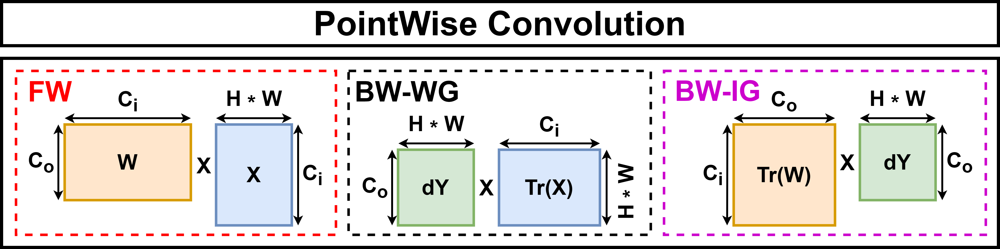

# Loop Unrolling in Matrix Multiplication

This tutorial covers another optimization PULP-TrainLib uses to speed up the layer primitives, i.e., loop unrolling.

In this tutorial, you will learn how to:
- introduce data reuse in a Matrix Multiplication algorithm by means of loop unrolling;
- use these new optimized kernels to speed up Convolutions.

This tutorial analyzes the case of FP32 Matrix Multiplication, but the reasoning can be extendend and fused with FP16 SIMD optimization.

## PointWise Convolution: Matrix Expressions

As for the Linear Layer, the PointWise Convolution's training primitives can be expressed by means of Linear Algebra operators, more specifically Matrix Multiplication. The matrix expression of the PointWise Convolution are as follows:



## Data Reuse and Loop Unrolling

As a starting point, we test the performances of the PointWise Convolution using a naive Matrix Mutiplication (mm) algorithm. In this case, the code of the mm executes an inner loop which multiplies the input matrices A (of size `N*K`) and B (of size `K*M`) row-by-row, iterating over 3 instruction, two load and 1 MAC, for `N*K*M` times.

```C
void mm(void * matMul_args) {

  struct matMul_args* args = (struct matMul_args *)matMul_args;
  float * __restrict__ A = args->A;
  float * __restrict__ B = args->B;
  float * __restrict__ C = args->C;

  const uint32_t N = args->N;
  const uint32_t M = args->M;
  const uint32_t K = args->K;

  uint32_t transp = args->trans_B;

  const uint32_t blockSize = (N+NUM_CORES-1) / NUM_CORES;
  const uint32_t start = pi_core_id()*blockSize;
  const uint32_t stop = start+blockSize > N ? N : start+blockSize;

  for (uint32_t i=start; i < stop; i++) 
    {
    for (uint32_t j = 0; j < M; j++) 
    {
        float temp = 0;
        for (uint32_t k = 0; k < K; k++) 
        {
            temp += A[i*K+k] * B[j+k*M];
          } 
          C[i*M+j] = temp;
        } 
    } 
}
```

Noting that each row element of the first matrix A is a common multiplication term with the colums of the second matrix B (and vice versa), it's possible to reduce the number of iterations by computing more than a single row-by-column product in the same inner loop ('unrolling'), using a single column of B as the common multiplicand with the rows of A:

```C
void mm_unroll_2x1 (void * matMul_args)
{
  struct matMul_args* args = (struct matMul_args *)matMul_args;
  float * __restrict__ A = args->A;
  float * __restrict__ B = args->B;
  float * __restrict__ C = args->C;

  uint32_t N = args->N;
  uint32_t M = args->M;
  uint32_t K = args->K;

  uint32_t transp = args->trans_B;
  uint32_t N_par = N & 0xfffffffe;
  uint32_t N_left = N - N_par;
  uint32_t core_id = pi_core_id();

  uint32_t blockSize = (N_par+NUM_CORES-1) / NUM_CORES;
  uint32_t start = core_id*blockSize;
  uint32_t stop = start+blockSize > N_par ? N_par : start+blockSize;

  for (uint32_t i=start; i<stop; i=i+2)
  {
    for (uint32_t j=0; j<M; j++)
    {
        float temp0 = 0;
        float temp1 = 0;

        for (uint32_t k=0; k<K; k++)
        {
            uint32_t idx   = i*K+k;
            float Bsh = B[k*M+j];
            temp0     += A[idx]   * Bsh;
            temp1     += A[idx+K] * Bsh;
        }
        C[i*M+j]      = temp0;
        C[(i+1)*M+j]  = temp1;
    }
  }
}
```

The reasoning can be extended also by loading multiple rows/columns of the second matrix, as well:

```C
void mm_unroll_2x4 (void * matMul_args)
{
  struct matMul_args* args = (struct matMul_args *)matMul_args;
  float * __restrict__ A = args->A;
  float * __restrict__ B = args->B;
  float * __restrict__ C = args->C;

  uint32_t N = args->N;
  uint32_t M = args->M;
  uint32_t K = args->K;
  uint32_t transp = args->trans_B;

  uint32_t N_par = N & 0xfffffffe;
  uint32_t N_left = N - N_par;
  uint32_t core_id = pi_core_id();

  uint32_t blockSize = (N_par+NUM_CORES-1) / NUM_CORES;
  uint32_t start = core_id*blockSize;
  uint32_t stop = start+blockSize > N_par ? N_par : start+blockSize;

  // Global accumulators
  float temp0 = 0;
  float temp1 = 0;
  float temp2 = 0;
  float temp3 = 0;
  float temp4 = 0;
  float temp5 = 0;
  float temp6 = 0;
  float temp7 = 0;

  for (uint32_t i=start; i<stop; i=i+2) 
  {
    for (uint32_t j=0; j<(M & 0xfffffffc); j=j+4)
    {
        temp0 = 0;
        temp1 = 0;
        temp2 = 0;
        temp3 = 0;
        temp4 = 0;
        temp5 = 0;
        temp6 = 0;
        temp7 = 0;

        for (uint32_t k=0; k<K; k++) 
        {
            uint32_t idx   = k*M+j;
            // First A row
            float Ash = A[i*K+k];
            float Ba  = B[idx];
            float Bb  = B[idx+1];
            float Bc  = B[idx+2];
            float Bd  = B[idx+3];
            temp0     += Ash * Ba;
            temp1     += Ash * Bb;
            temp2     += Ash * Bc;
            temp3     += Ash * Bd;
            // Second A row
            Ash       = A[(i+1)*K+k];
            temp4     += Ash * Ba;
            temp5     += Ash * Bb;
            temp6     += Ash * Bc;
            temp7     += Ash * Bd;
        }
        C[i*M+j]        = temp0;
        C[i*M+j+1]      = temp1;
        C[i*M+j+2]      = temp2;
        C[i*M+j+3]      = temp3;
        C[(i+1)*M+j]    = temp4;
        C[(i+1)*M+j+1]  = temp5;
        C[(i+1)*M+j+2]  = temp6;
        C[(i+1)*M+j+3]  = temp7;
    }
  }
}
```

Unrolling elements can be performed up to when all the registers are full, which, in our architecture, often occurs with more than 2x4 or 4x2 unrolling.

## Optimizing a PointWise Convolution in FP32 with Loop Unrolling

Here, we test the effects of loop unrolling on a single forward training step of a PointWise Convolution. From this folder, first:

```
cd test_conv_pw_dw_fp32/
```

First case: naive mm

```
make clean get_golden all run STEP='PW_FORWARD' MATMUL_TYPE=0
```
The obtained number of cycles is `77491`.


Second case: 2x1 unrolling

```
make clean get_golden all run STEP='PW_FORWARD' MATMUL_TYPE=6
```
The obtained number of cycles is `49884` (1.55x speedup with respect to the naive one).


Third case (max unrolling): 2x4 unrolling 

```
make clean get_golden all run STEP='PW_FORWARD' MATMUL_TYPE=10
```
The obtained number of cycles is `35465` (2.18x speedup with respect to the naive one).


## Set Loop Unrolling in the TrainLib Deployer

PULP-TrainLib contains a set of unrolled version of the mm algorithm for both FP32 and FP16. The list of optimized mm kernels, with unrolling and parallelization for FP32 and with unrolling, parallelization and SIMD for FP16, can be found in [mm_manager_list.txt](../pulp-trainlib/lib/include/mm_manager_list.txt) (FP32) and [mm_manager_list_fp16.txt](../pulp-trainlib/lib/include/mm_manager_list_fp16.txt) (FP16) with their reference number. These files derive from the list present in [pulp_matmul_fp32.h](../pulp-trainlib/lib/include/pulp_matmul_fp32.h) and [pulp_matmul_fp16.h](../pulp-trainlib/lib/include/pulp_matmul_fp32.h), respectively. Also, at runtime, the selection of the mm algorithm is managed by the functions `mm_manager()` and `mm_manager_fp16()`.

## References

> D. Nadalini, M. Rusci, G. Tagliavini, L. Ravaglia, L. Benini, and F. Conti, "PULP-TrainLib: Enabling On-Device Training for RISC-V Multi-Core MCUs through Performance-Driven Autotuning" [SAMOS Pre-Print Version](https://www.samos-conference.com/Resources_Samos_Websites/Proceedings_Repository_SAMOS/2022/Papers/Paper_14.pdf), [Springer Published Version](https://link.springer.com/chapter/10.1007/978-3-031-15074-6_13)