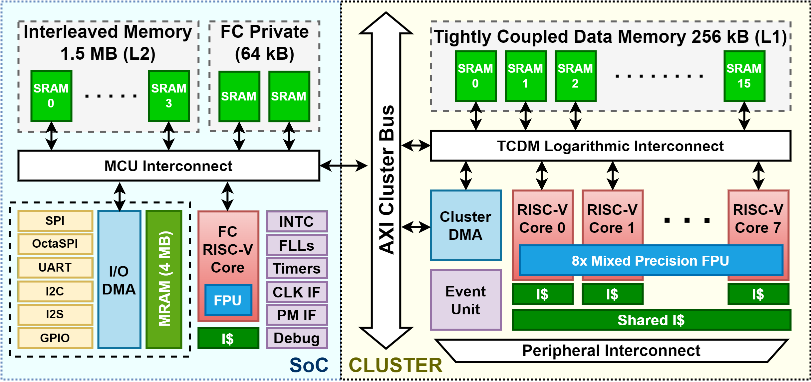

# PULP-TrainLib-Tutorial

This repository contains several tutorial sessions to become familiar with PULP-TrainLib and On-Device Learning on RISC-V Parallel Ultra-Low Power systems.

## Prerequisites

This tutorial has been tested with the following requirements:
```
- Windows WSL with Ubuntu 20.04 LTS
- Ubuntu 20.04 LTS
- Anaconda or Miniconda
- make
- GCC <= 9.4
```

We do not provide any guarantee on other setups.

## Installation

To install all the components required by PULP-TrainLib, simply:
```
source install_ub18.sh
```

Then, close the installation terminal and open a new one.

An experimental setup for Ubuntu 22 is provided, but not guarantee to work.

## Executing code based on PULP-TrainLib

To compile and run projects based on PULP-TrainLib's code, on a new terminal:

```
source setup.sh 
cd pulp-trainlib/tests/xxx
make clean get_golden all run <OPTIONS>
```

You can check the available options into the `Makefile` of each test.


# PULP-TrainLib: a General Overview

PULP-TrainLib is the first On-Device Learning optimized for RISC-V Multi-Core MCUs, tailored for the Parallel Ultra-Low Power [(PULP) Platform](https://www.pulp-platform.org/). 

## On-Device Learning

On-Device Learning is a novel paradigm aiming at enabling Artificial Intelligence (AI) to be trained on the low-power edge device, without the intervention of external resources. This enables increased levels of privacy, as the user data never leaves the edge device, decreases the network traffic, and makes the network scalability easier. Furthermore, the latency of the user personalization is reduced, as updates are computed on-the-fly, without waiting for a server to retrain and deploy a new model.

## The PULP Platform

The [PULP Platform](https://www.pulp-platform.org/) is a fully open-source (both hardware and software) computational platform for scalable edge computing, based on RISC-V cores. 

An example of a PULP-based System-on-Chip (SoC) is the following:



In this embodiment, the Cluster features 8 parallel cores (Cores 0 to 7) for the computation, and a Cluster Controller core (Core 8) to better schedule tasks assigned to the Cluster.

PULP-TrainLib makes efficient use of the available resources of the PULP-based SoCs, which feature:

- A single Core (Fabric Controller) for the control of the system
- A Cluster of N RISC-V Cores capable of computing parallel tasks
- A hierarchical memory system, featuring a Cluster-reserved fast L1 memory and a system-level L2 memory
- A Cluster DMA to access the L2 memory from the Cluster in few cycles
- Tightly coupled accelerators, as a Mixed-Precision FPU, available for the Cluster 

## General Structure

PULP-TrainLib is available as open source [here](https://github.com/pulp-platform/pulp-trainlib). Further details on PULP-TrainLib can be found in the related [README.md](../pulp-trainlib/README.md). 

In short, PULP-TrainLib is organized as follows:

```
lib/                            
        include/                
        sources/                

tests/                          
        test_<layer/function>_<possible_options>

tools/                          
        AutoTuner/              
        TrainLib_Deployer/      
```

PULP-TrainLib is written in C code, with specific calls to the [PULP PMSIS libraries](https://github.com/pulp-platform/pulp-sdk/tree/main/rtos/pmsis) for parallel execution.
To include PULP-TrainLib in your project, simply `#include "pulp_train.h"`.

## Contributing

The project is open-source. In case you want to contribute, open a pull request on the official repository [https://github.com/pulp-platform/pulp-trainlib](https://github.com/pulp-platform/pulp-trainlib), or contact the [maintainers](https://github.com/pulp-platform/pulp-trainlib/blob/main/README.md#contributors). We are willing to collaborate on the project!

## References

> D. Nadalini, M. Rusci, G. Tagliavini, L. Ravaglia, L. Benini, and F. Conti, "PULP-TrainLib: Enabling On-Device Training for RISC-V Multi-Core MCUs through Performance-Driven Autotuning" [SAMOS Pre-Print Version](https://www.samos-conference.com/Resources_Samos_Websites/Proceedings_Repository_SAMOS/2022/Papers/Paper_14.pdf), [Springer Published Version](https://link.springer.com/chapter/10.1007/978-3-031-15074-6_13)

> D. Nadalini, M. Rusci, L. Benini, and F. Conti, "Reduced Precision Floating-Point Optimization for Deep Neural Network On-Device Learning on MicroControllers" [ArXiv Pre-Print](https://arxiv.org/abs/2305.19167)

